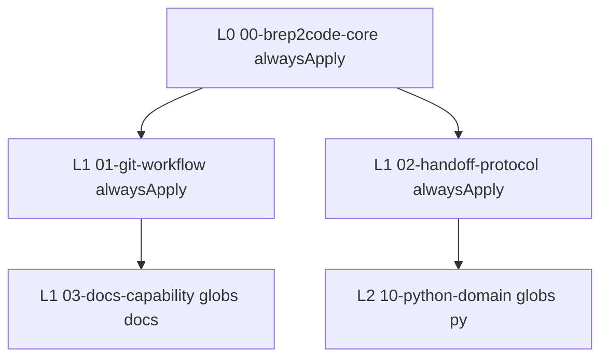

# Agent 规则分层

Cursor 规则位于 `.cursor/rules/*.mdc`，通过 frontmatter 控制作用域。

## 层级图

## 各层职责

### L0 — 项目核心

- 文件：`.cursor/rules/00-brep2code-core.mdc`
- `alwaysApply: true`
- 强制读 `AGENTS.md`、会话结束前更新 Handoff、优先使用 Skills

### L1 — 流程规则

| 文件 | 内容 |
|------|------|
| `01-git-workflow.mdc` | Git 安全与提交约定 |
| `02-handoff-protocol.mdc` | Handoff 模板与路径 |
| `03-docs-capability.mdc` | 编辑 docs 时写 ADR/runbook |

### L2 — 领域规则

- 文件：`.cursor/rules/10-python-domain.mdc`
- `globs: **/*.py`
- Python / SDK / harness 约定（代码落地后填充）

## 与 Skills 的关系

| 机制 | 作用 | 触发 |
|------|------|------|
| Rules | 持续约束 Agent 行为 | 自动（alwaysApply / globs） |
| Skills | 封装多步标准作业 | 显式引用 skill 名 |

Rules 定义「必须遵守什么」；Skills 定义「如何一步步完成某流程」。
