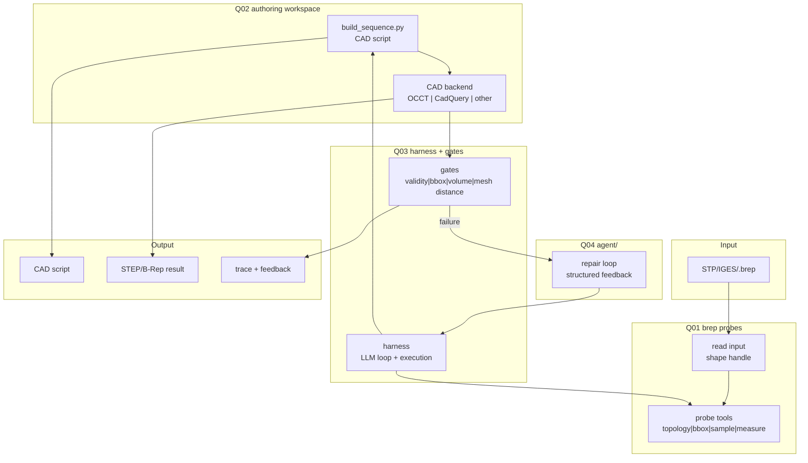

# Brep2Code v1 — Harness-first 总架构

## 设计命题

将 **B-Rep → CAD 结果** 归约为：通用 LLM 在受限 workspace 中迭代编写 CAD 脚本，Harness 提供 B-Rep probe tools、脚本执行、结果导出、门控和结构化反馈。

v1 的优先级是把闭环跑起来。B-Rep 解读以按需 probe 为主；IR、SDK 分层、CAD workplace 和专用模型路线在案例积累后再收敛。

## 数据流

## Q01–Q04 职责

| 阶段 | 当前职责 | 必须产出 |
|------|----------|----------|
| **Q01** | B-Rep 读入与按需 probe | LLM 可调用的 `probe_*` 工具结果 |
| **Q02** | CAD 脚本编写 | `build_sequence.py` 或等价脚本 |
| **Q03** | Harness 执行和门控 | artifacts + `signal_bundle.json` |
| **Q04** | 反馈修复 | 修改后的脚本与下一轮 trace |

## Articraft → Brep2Code 模块对照

| Articraft 概念 | Brep2Code v1 对应 |
|----------------|------------------|
| 受限 workspace | record/revision 下的 CAD 脚本 |
| tools | B-Rep probe、bounded tool bridge、artifact/trace query |
| harness | 脚本执行、CAD 后端调用、日志收集、gates |
| feedback | `signal_bundle.json` |
| repair loop | 通用 LLM 基于信号继续修改脚本 |

## 代码仓库

当前仓库：`D:\codeai\Brep2Code`。详见 [modules/README.md](modules/README.md)。

## Links

- [README.md](README.md) — v1 入口
- [decisions.md](decisions.md) — 当前决策
- `D:\paper\Projects\Brep2Code-research\routes\q01-q04-synthesis.md` — 文献总论

